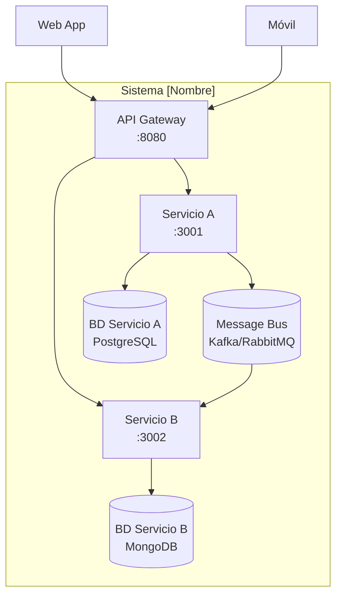

# Vista de Arquitectura del Sistema

> **Qué llenar aquí:** La vista arquitectónica es la fotografía técnica del sistema.
> Incluye el diagrama C4 nivel sistema y contenedor, lista de servicios, y principios arquitectónicos.
> Este documento se crea después de los ADRs principales y guía la implementación.

---

## 1. Estilo arquitectónico adoptado

**Estilo:** [Microservicios / Microservicios + Event-Driven / Modular Monolith / etc.]

**Justificación:** [Por qué este estilo para este proyecto y estos requisitos]

**ADR de referencia:** [`ADR-001-estilo-arquitectonico.md`](decisions/records/)

---

## 2. Diagrama C4 — Nivel Sistema (Context)

> Muestra cómo el sistema encaja en el mundo. Actores externos y sistemas externos.

```
┌─────────────────────────────────────────────────────────────────────┐
│                        Sistema [Nombre]                             │
│                                                                     │
│  ┌─────────────┐    ┌─────────────┐    ┌────────────────────────┐  │
│  │ [Servicio A]│    │ [Servicio B]│    │ [Servicio C]           │  │
│  │             │    │             │    │                        │  │
│  │ Puerto: 3001│    │ Puerto: 3002│    │ Puerto: 3003           │  │
│  └──────┬──────┘    └──────┬──────┘    └──────────┬─────────────┘  │
│         │                  │                       │                │
│         └──────────────────┴───────────────────────┘                │
│                            │ Message Bus                             │
└────────────────────────────│────────────────────────────────────────┘
                             │
                  ┌──────────┴──────────┐
                  │                     │
         ┌────────▼──────┐    ┌─────────▼──────┐
         │ API Gateway   │    │ Admin Dashboard │
         │               │    │                 │
         └────────┬──────┘    └─────────────────┘
                  │
         ┌────────▼──────────────┐
         │    Clientes externos  │
         │  (Web, Móvil, API)    │
         └───────────────────────┘
```

---

## 3. Diagrama C4 — Nivel Contenedor (Container)

> Muestra los procesos, bases de datos, y canales de comunicación principales.

```
Reemplaza este bloque con el diagrama específico del proyecto.

Herramientas recomendadas:
- PlantUML (ver 08-uml/diagrams/source/)
- Mermaid (soportado en GitHub nativametne)
- draw.io / Lucidchart
```

**Mermaid de ejemplo:**



---

## 4. Catálogo de servicios

| # | Servicio | Responsabilidad | Puerto | BD | Tipo comunicación |
|---|---------|----------------|--------|-----|------------------|
| 1 | [api-gateway] | Enrutamiento, auth, rate limiting | 8080 | Redis (caché) | Proxy HTTP |
| 2 | [auth-service] | Registro, login, tokens JWT | 3001 | PostgreSQL | REST + Eventos |
| 3 | [xxx-service] | [responsabilidad] | 300X | [BD] | [REST/Async] |

> Detalle completo por servicio en `09-microservices/service-catalog.md`

---

## 5. Principios arquitectónicos

Estos principios guían las decisiones técnicas del proyecto. Antes de tomar una decisión
importante, verifica que sea consistente con estos principios.

### P1: API-First
Diseña el contrato API (OpenAPI) antes de implementar el servicio.
Los contratos son la fuente de verdad para los consumidores.

### P2: Database per Service
Cada servicio tiene su propia base de datos. Ningún servicio accede directamente
a la base de datos de otro. La comunicación es siempre por API o eventos.

### P3: Fail Fast, Recover Gracefully
Detecta errores temprano (validación en la entrada). Cuando falla un servicio externo,
usa Circuit Breaker para evitar cascadas. Define siempre un fallback.

### P4: Observability by Design
Desde el día 1: logs estructurados en JSON, métricas con Prometheus,
trazas distribuidas con Jaeger/Zipkin. No es opcional ni una historia para "después".

### P5: [Nombre del principio adicional]
[Descripción]

---

## 6. Patrones arquitectónicos adoptados

| Patrón | Adoptado | Referencia |
|--------|----------|-----------|
| API Gateway | Sí | `05-architecture/pattern-guide.md` |
| Database per Service | Sí | ADR-00X |
| CQRS | No (revisión en Q3) | |
| Event Sourcing | No | |
| Circuit Breaker | Sí | ADR-00X |
| Saga (coreografiada) | Sí | ADR-00X |
| Outbox Pattern | Sí | ADR-00X |

---

## 7. Cross-cutting concerns

Preocupaciones transversales que aplican a TODOS los servicios:

| Concern | Solución adoptada | Dónde se configura |
|---------|------------------|--------------------|
| Autenticación / Autorización | JWT + validación en API Gateway | `00-governance/security-policy.md` |
| Logging | JSON estructurado + Correlation ID | Logger compartido en lib interna |
| Tracing | OpenTelemetry → Jaeger | Middleware en cada servicio |
| Health Checks | GET /health (liveness) + GET /health/ready (readiness) | Template de servicio |
| Error format | ErrorResponse estándar | `07-api/contracts/openapi/_shared.yaml` |
| Rate Limiting | En el API Gateway | Configuración de Kong/NGINX |
| CORS | Configurado en API Gateway | |
| Circuit Breaker | Resiliency4j / opossum por servicio | Patrón en `pattern-guide.md` |

---

## 8. Deuda técnica arquitectónica registrada

| ID | Descripción | Impacto | Prioridad | Sprint objetivo |
|----|-------------|---------|-----------|----------------|
| AT-001 | [descripción] | [alto/medio/bajo] | [P1/P2/P3] | [Sprint X] |

> Ver también: `15-project-control/technical-backlog.md`

---

## 9. Evolución planificada

| Versión | Cambio arquitectónico | Motivación | Fecha estimada |
|---------|----------------------|------------|----------------|
| v2.0 | [ej: Migrar a gRPC para comunicación interna] | [Latencia] | [Q4 2024] |

---

## Correlaciones clave

- Bounded contexts del dominio → `02-domain/domain-map.md`
- ADRs de decisiones específicas → `05-architecture/decisions/`
- Arquitectura hexagonal por servicio → `05-architecture/hexagonal-architecture.md`
- Patrones aplicados → `05-architecture/pattern-guide.md`
- Detalle por servicio → `09-microservices/service-catalog.md`
- Diagramas UML → `08-uml/`
