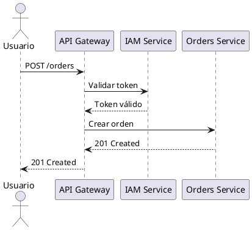
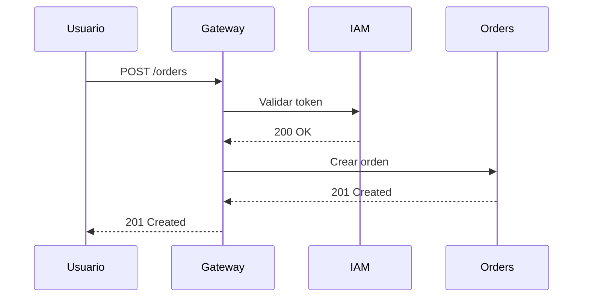

# 08 — Diagramas UML

> **¿Qué es esto?** Representaciones visuales del sistema. Los diagramas comunican en segundos
> lo que tomaría páginas de texto.

## Regla de los diagramas

> **Un diagrama desactualizado es peor que ningún diagrama** — genera confianza falsa.
>
> Mantén solo los diagramas que el equipo actualiza regularmente. Mejor 3 diagramas actuales
> que 10 diagramas obsoletos.

---

## Tipos de diagramas por propósito

### Para arquitectura (recomendados)
- **C4 — System Context (Nivel 1):** el sistema en relación con el mundo exterior
- **C4 — Container (Nivel 2):** los microservicios, BDs y frontends del sistema
- **C4 — Component (Nivel 3):** los componentes internos de un servicio específico

### Para datos
- **ER (Entidad-Relación):** tablas y sus relaciones — uno por servicio o uno global

### Para comportamiento
- **Secuencia:** flujo temporal de una operación que cruza múltiples servicios
- **Estado:** ciclo de vida de una entidad (ej: estados de un pedido)
- **Actividad:** flujo de un proceso de negocio complejo

---

## Herramientas recomendadas

### PlantUML (para diagramas en código)


### Mermaid (soportado en GitHub/GitLab)


### Draw.io / Lucidchart
Para diagramas más complejos que requieren libre colocación. Exportar como SVG a `diagrams/exports/`.

---

## Estructura de carpetas

```
08-uml/
├── diagram-index.md          ← Registro de todos los diagramas
├── diagrams/
│   ├── source/               ← Archivos fuente (.puml, .drawio, .mmd)
│   └── exports/              ← Imágenes exportadas (.svg, .png)
```

**Convención de nombres:**
- `c4-context.puml` — Diagrama C4 Nivel 1
- `c4-containers.puml` — Diagrama C4 Nivel 2
- `seq-login.puml` — Diagrama de secuencia del flujo de login
- `er-iam-service.puml` — Diagrama ER del servicio IAM
- `state-order.puml` — Diagrama de estados de una orden

### `diagram-index.md`
Registro de todos los diagramas con su propósito y ubicación.

**Formato:**
```markdown
| Diagrama | Tipo | Archivo fuente | Última actualización | Quién lo mantiene |
|---------|------|----------------|---------------------|------------------|
| Arquitectura global | C4-L2 | c4-containers.puml | 2024-03-01 | [nombre] |
| Flujo de login | Secuencia | seq-login.puml | 2024-03-01 | [nombre] |
```

---

## Correlaciones con otras secciones

| Se alimenta de... | Qué diagrama crear |
|------------------|--------------------|
| `05-architecture/overview.md` | Diagrama C4 Nivel 1 y 2 |
| `06-data/models.md` | Diagramas ER por servicio |
| `09-microservices/communication-patterns.md` | Diagramas de secuencia de flujos |
| `02-domain/domain-map.md` | Diagrama de bounded contexts |
