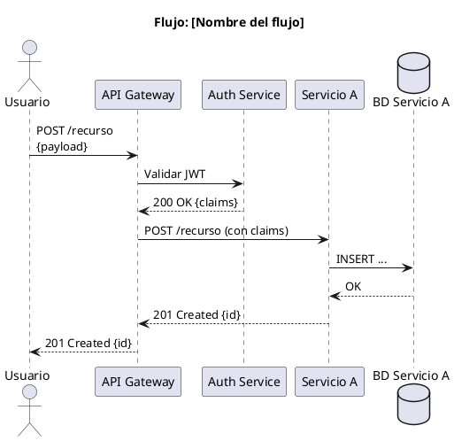
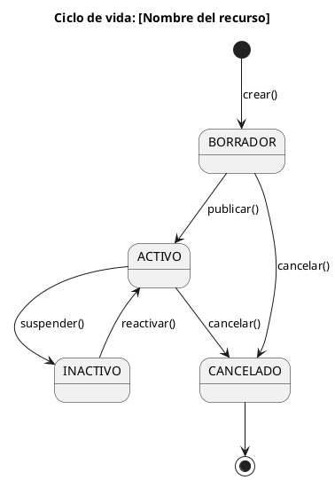
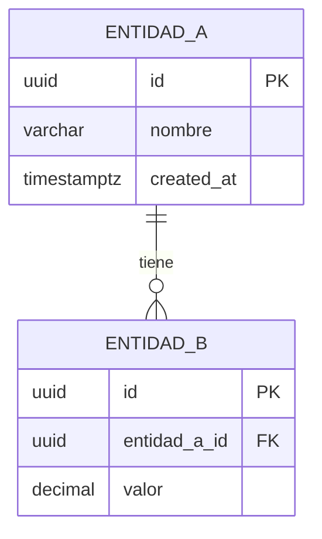

# Índice de Diagramas

> **Qué llenar aquí:** El registro de todos los diagramas del sistema.
> Los diagramas van en `08-uml/diagrams/source/` como archivos PlantUML o Mermaid.
> Los renders exportados van en `08-uml/diagrams/rendered/`.

---

## ¿Cuándo crear un diagrama?

```
✓ Cuando el flujo involucra 3+ servicios o actores
✓ Cuando la arquitectura necesita ser comunicada a un stakeholder no técnico
✓ Cuando el modelado de datos es complejo (diagrama ER)
✓ Cuando un bug tardó más de 2 horas en entenderse (diagrama de secuencia retroactivo)

✗ Para flujos simples de 2 elementos — el código los describe mejor
✗ Para "documentar por documentar" — un diagrama desactualizado es peor que ninguno
```

---

## Nomenclatura de archivos

```
[nivel-c4]-[nombre-descriptivo].[puml|mmd]

Ejemplos:
  c1-system-context.puml
  c2-container-diagram.puml
  c3-auth-service.puml
  seq-crear-pedido.puml
  erd-pedidos-service.mmd
  state-pedido-lifecycle.puml
```

---

## Registro de diagramas

### Diagramas de arquitectura (C4)

| ID | Nombre | Tipo | Herramienta | Archivo fuente | Descripción |
|----|--------|------|-------------|----------------|-------------|
| C4-01 | System Context | C4 L1 | PlantUML | `source/c1-system-context.puml` | El sistema y sus actores externos |
| C4-02 | Container Diagram | C4 L2 | PlantUML | `source/c2-container-diagram.puml` | Todos los servicios y BDs |
| C4-03 | [Servicio A] Components | C4 L3 | PlantUML | `source/c3-servicio-a.puml` | Componentes internos del servicio |

### Diagramas de secuencia

| ID | Nombre | Herramienta | Archivo fuente | Descripción |
|----|--------|-------------|----------------|-------------|
| SEQ-01 | Flujo de login | PlantUML | `source/seq-login.puml` | Registro → Login → JWT |
| SEQ-02 | [Flujo principal] | PlantUML | `source/seq-[nombre].puml` | [Descripción] |
| SEQ-03 | [Flujo de error] | PlantUML | `source/seq-[nombre]-error.puml` | [Escenario de error] |

### Diagramas de estado

| ID | Nombre | Herramienta | Archivo fuente | Descripción |
|----|--------|-------------|----------------|-------------|
| ST-01 | Ciclo de vida de Pedido | PlantUML | `source/state-pedido.puml` | Estados y transiciones de Pedido |

### Diagramas ER (datos)

| ID | Nombre | Herramienta | Archivo fuente | Servicio |
|----|--------|-------------|----------------|---------|
| ERD-01 | BD Pedidos | Mermaid | `source/erd-pedidos.mmd` | pedido-service |
| ERD-02 | BD Auth | Mermaid | `source/erd-auth.mmd` | auth-service |

---

## Plantillas de diagramas

### C4 L1 — Context (PlantUML)

```plantuml
@startuml C4-Context
!include https://raw.githubusercontent.com/plantuml-stdlib/C4-PlantUML/master/C4_Context.puml

title System Context — [Nombre del Sistema]

Person(usuario, "Usuario", "Descripción del usuario")
Person_Ext(admin, "Administrador", "Administra el sistema")

System(sistema, "[Nombre del Sistema]", "Descripción de lo que hace")

System_Ext(sistemaExterno, "[Sistema Externo]", "Descripción del sistema externo")

Rel(usuario, sistema, "Usa", "HTTPS")
Rel(admin, sistema, "Administra", "HTTPS")
Rel(sistema, sistemaExterno, "Envía datos a", "REST API")

@enduml
```

### Diagrama de secuencia (PlantUML)



### Diagrama de estado (PlantUML)



### Diagrama ER (Mermaid)



---

## Herramientas y renderizado

| Herramienta | Para qué | Cómo usar |
|-------------|---------|-----------|
| PlantUML | Diagramas C4, secuencia, estado, clase | `plantuml -tsvg archivo.puml` |
| Mermaid | Diagramas simples en Markdown | Soporte nativo en GitHub y GitLab |
| draw.io (diagrams.net) | Diagramas visuales complejos | Exportar como XML + imagen |
| Structurizr | C4 model con DSL | Para proyectos que adopten el DSL de C4 |

**Pipeline de renderizado:**
```bash
# Renderizar todos los diagramas PlantUML
find 08-uml/diagrams/source -name "*.puml" -exec plantuml -tsvg -o ../rendered {} \;

# O con Docker (sin instalar PlantUML localmente)
docker run --rm -v $(pwd):/data ghcr.io/plantuml/plantuml:latest \
  -tsvg -o /data/08-uml/diagrams/rendered /data/08-uml/diagrams/source/*.puml
```

---

## Correlaciones

- Vista de arquitectura → `05-architecture/overview.md`
- Bounded contexts del dominio → `02-domain/domain-map.md`
- Modelos ER de cada servicio → `09-microservices/services/NN/data-model.md`
